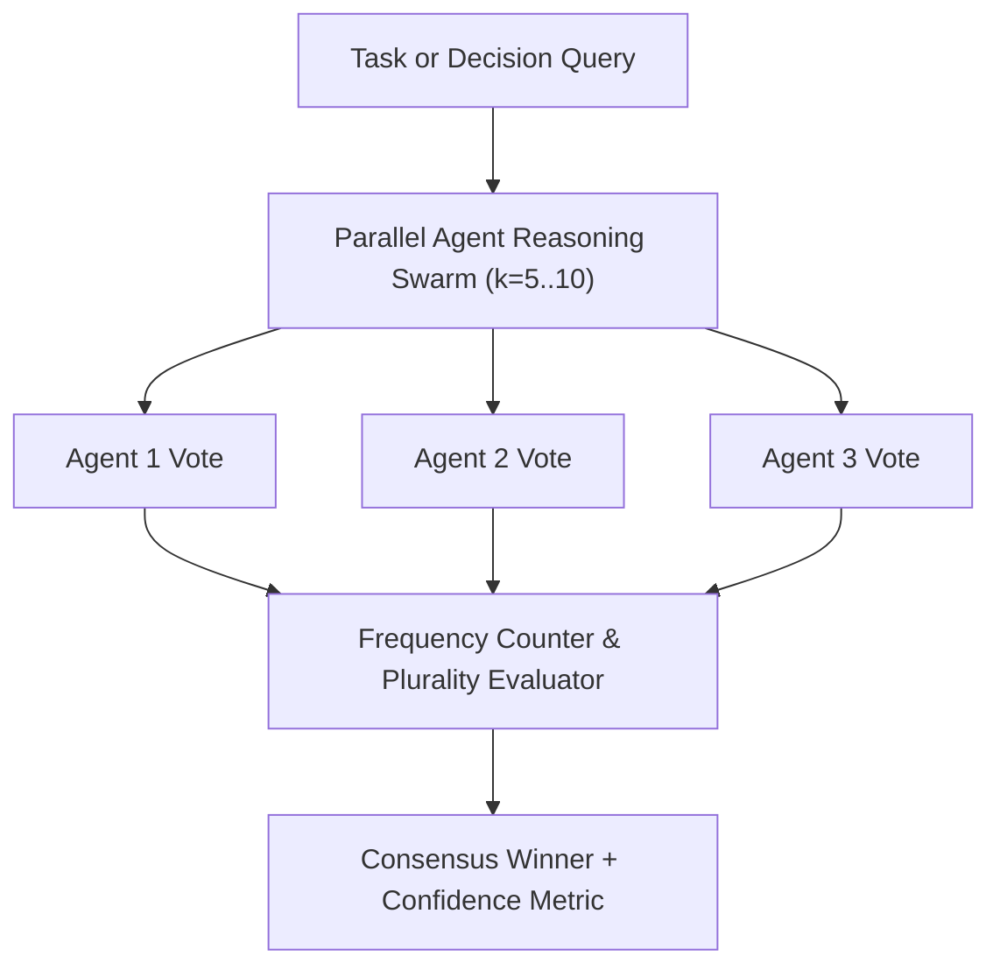

# genpark-swarm-majority-voting-verifier-skill

Agent Skill implementing **Swarm Majority Voting & Self-Consistency Verification** in 100% Python standard library.

## Architectural Flow

```mermaid
flowchart TD
    Input["Task or Decision Query"] --> Swarm["Parallel Agent Reasoning Swarm (k=5..10)"]
    Swarm --> V1["Agent 1 Vote"]
    Swarm --> V2["Agent 2 Vote"]
    Swarm --> V3["Agent 3 Vote"]
    V1 & V2 & V3 --> Aggregator["Frequency Counter & Plurality Evaluator"]
    Aggregator --> Output["Consensus Winner + Confidence Metric"]
```
